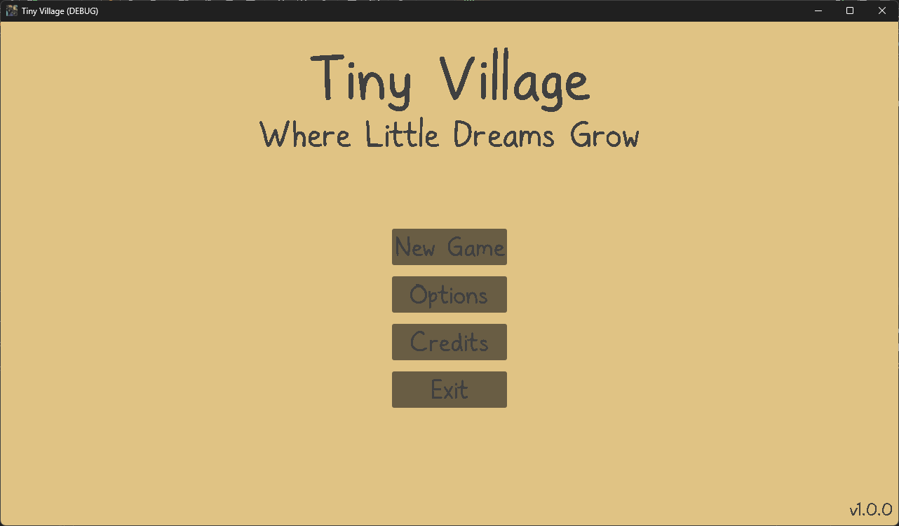
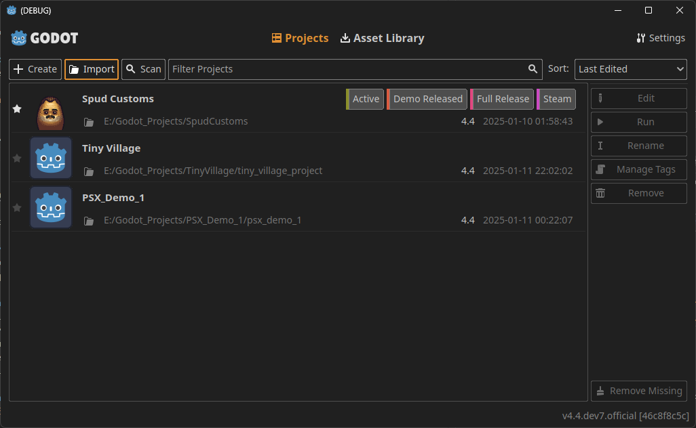
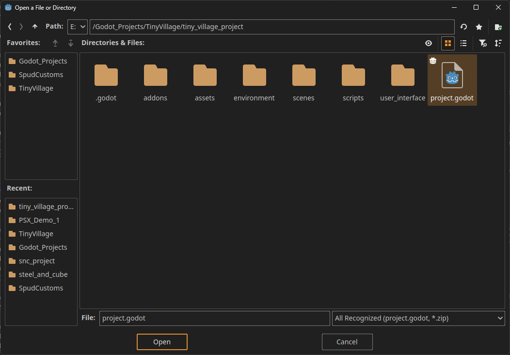
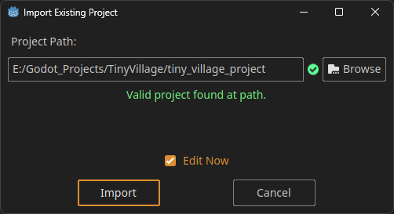
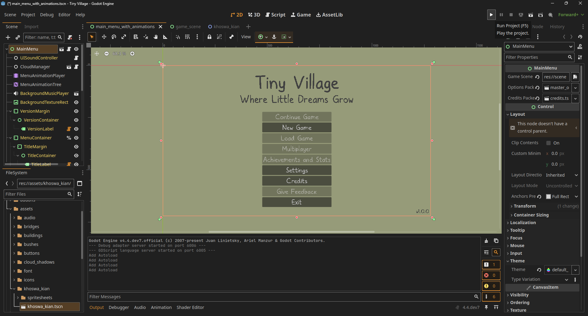

# Tiny Village

A cozy village-building simulator where you create your own procedurally-generated settlements. Build unique villages by placing roads, houses, and decorative elements.



## Project Management

### Development Roadmap
#### Phase 1: Core Mechanics
- Basic building placement system
- Grid-based terrain generation
- Simple resource management
- Initial UI implementation

#### Phase 2: Visual Enhancement
- Advanced lighting system
- Weather effects
- Particle systems

#### Phase 3: Marketing
- Marketing
- Steam page
- Giveaway keys to Reviewers, YouTubers, Patreon Supporters, Ko-Fi Supporters, and community members

#### Phase 4: Content Expansion
- New building types
- Villager AI behaviors
- Quest system

#### Phase 5: Polishing
- Playtesters 
- Review/Polish
- Bugfixes

#### Phase 5: Release
- Release the game on Steam

### Project Structure
```
project_management/
├── project_direction/
│   ├── screenshots/         				# Inspiration screenshots from other projects
│   ├── game_design_document.md				# Basic game design document
│   └── possible_assets.md   				# Asset planning and requirements
├── screenshots/             				# Marketing and documentation screenshots
├── lore.md									# Backstory  and outlines for the lore of the game
├── possible_assets.md 						# Assets such as plugins and art which could be used
├── scratch_pad.md 							# Random ideas and tasks to complete
└── todo_list.md 							# Tasks which need to be completed
```

## Getting Started

### Prerequisites
- Godot Engine v4.4.dev7.official [46c8f8c5c] or similar
- Git
- Markdown Reader

### Installation
1. Clone the repository
```bash
git clone https://github.com/yourusername/tiny-village.git
```
2. Open Godot Engine
3. Import the `project.godot` under `TinyVillage/tiny_village_project/project.godot`



2. Open the project in Godot Engine





3. Run the project using F5 or the "Play" button



## Contributing
We welcome contributions!

### Areas for Contribution
- Bug fixes
- Performance improvements
- Documentation improvements
- New art
- Localization

## License
[LICENSE.md](LICENSE.md)

## Credits
[ATTRIBUTION.md](tiny_village_project/addons/maaacks_menus_template/examples/ATTRIBUTION.md)