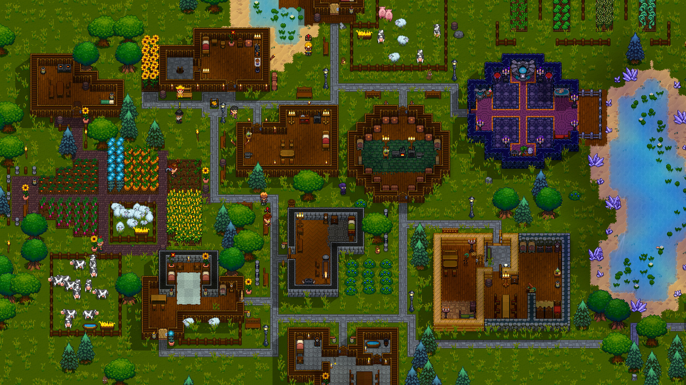
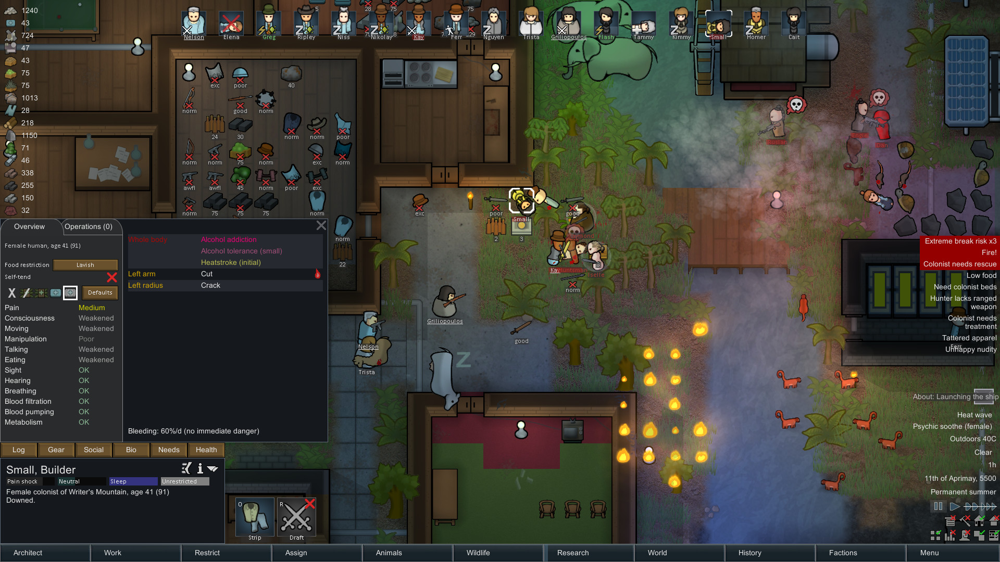
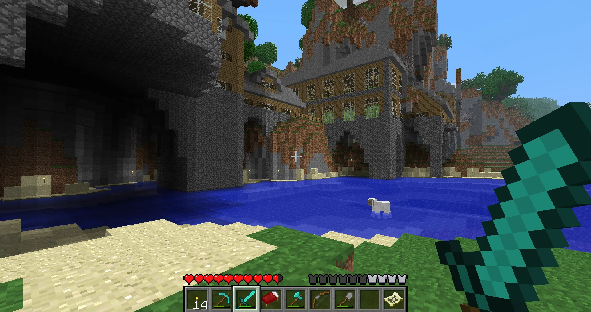
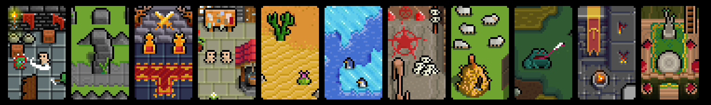

# Inspirations
## [Necesse](https://store.steampowered.com/app/1169040/Necesse/)

## [Rimworld](https://store.steampowered.com/app/294100/RimWorld/)

## [BetaCraft](https://betacraft.uk/)

# Graphics
## [Mini-fantasy](https://krishna-palacio.itch.io/)

- 2D
- Isometric or Top-down perspective
- Doodle-themed?
- Resource management

# Thoughts
I love Necesse but when I play it I feel overwhelmed by the options and depth.
Which leads me to want to develop a simpler version, one without the struggles of 
NPC management, similar to that of the simplicity of Beta Minecraft. Core items such
as tools, weapons, armor, and healing items. 

I want to create the top-down style and base-building that Necesse provides with the 
simplicity of older games, a core loop of exploration, character progression, and 
base-building. 